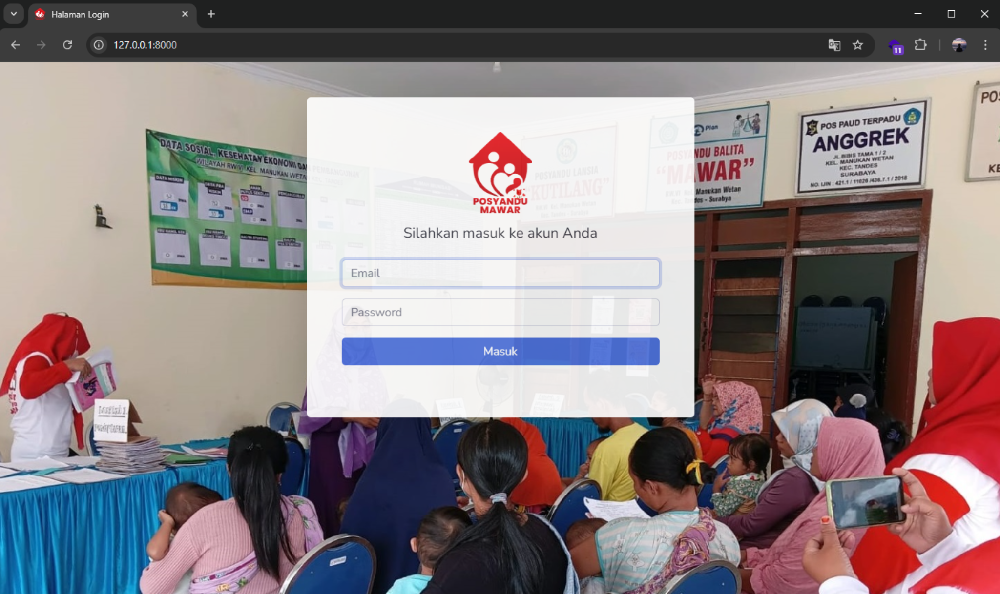
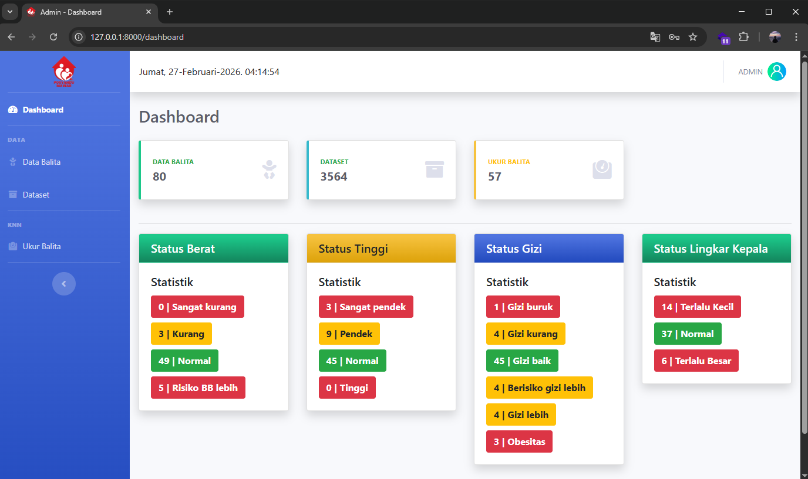
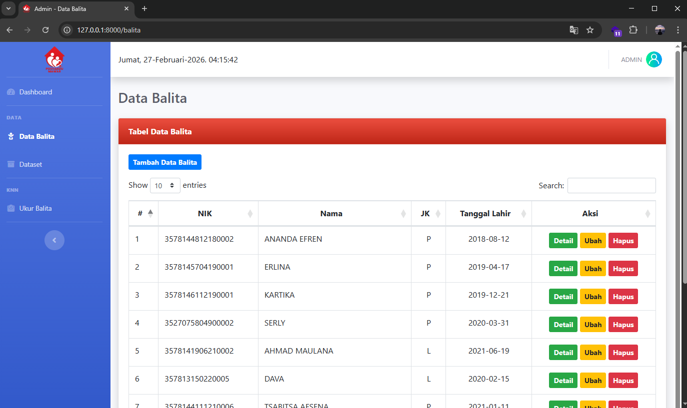
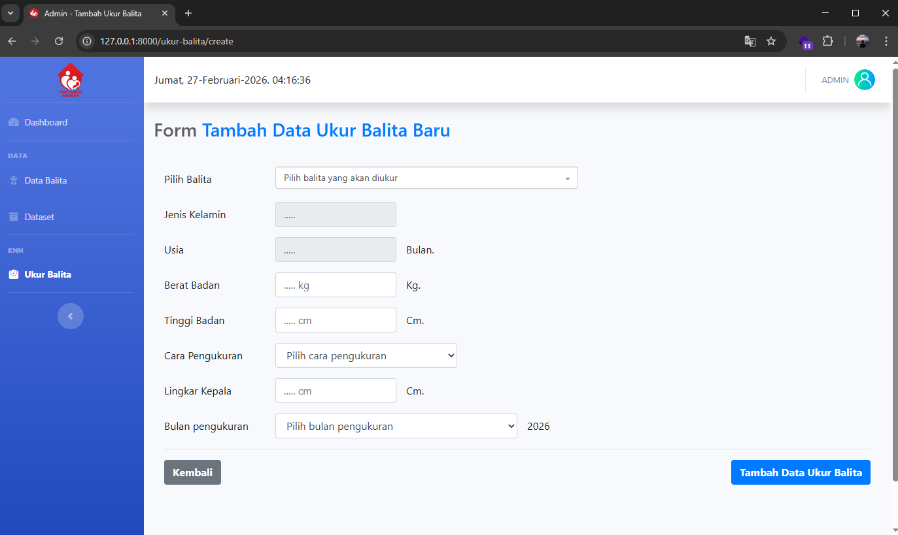
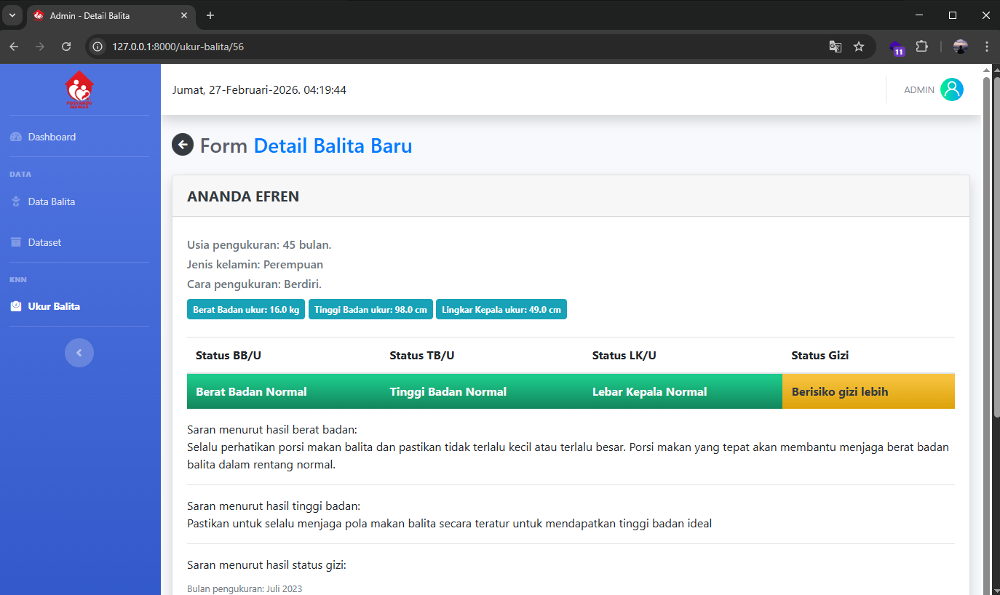
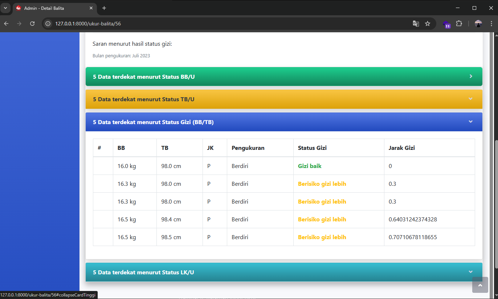
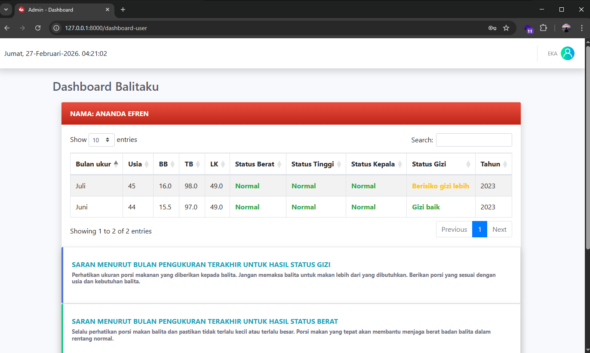

# POSYANDU MAWAR — Klasifikasi Status Gizi Balita (K-NN)


Aplikasi berbasis web untuk membantu **kader Posyandu Mawar (Bibis Tama, Surabaya)** dalam:
- mengelola data balita,
- mencatat hasil pengukuran antropometri,
- dan **mengklasifikasikan status gizi balita** menggunakan metode **K-Nearest Neighbor (K-NN)**.

---

## Daftar Isi
- [Gambaran Umum](#gambaran-umum)
- [Screenshot](#screenshot)
- [Fitur](#fitur)
- [Teknologi](#teknologi)
- [Prasyarat](#prasyarat)
- [Instalasi & Menjalankan Aplikasi (Local)](#instalasi--menjalankan-aplikasi-local)
- [Akun Demo (Default)](#akun-demo-default)
- [Alur Penggunaan Singkat (Admin)](#alur-penggunaan-singkat-admin)
- [Catatan Penting Metode K-NN (Ringkas)](#catatan-penting-metode-k-nn-ringkas)
- [Struktur Folder Penting](#struktur-folder-penting)
- [Lisensi](#lisensi)
- [Kredit](#kredit)

---

## Gambaran Umum
Penentuan status gizi dilakukan berdasarkan parameter:
- Usia (bulan)
- Jenis kelamin
- Berat badan (kg)
- Tinggi/Panjang badan (cm)
- Lingkar kepala (cm)

Hasil klasifikasi yang ditampilkan mencakup:
- Status berat badan
- Status tinggi badan
- Status lingkar kepala
- Status gizi (mis. gizi buruk/kurang/baik, berisiko gizi lebih, gizi lebih, obesitas)

Aplikasi ini dibuat untuk kebutuhan tugas akhir/skripsi dan berjalan dengan baik pada lingkungan lokal (localhost).

---

## Screenshot

### Thumbnail Grid (Klik untuk memperbesar)

<table>
  <tr>
    <td align="center" width="33%">
      <a href="docs/screenshots/01-login.png">
        
      </a>
      <br/><b>1. Halaman Login</b>
    </td>
    <td align="center" width="33%">
      <a href="docs/screenshots/02-dashboard-admin.png">
        
      </a>
      <br/><b>2. Dashboard Admin</b>
    </td>
    <td align="center" width="33%">
      <a href="docs/screenshots/03-data-balita.png">
        
      </a>
      <br/><b>3. Data Balita</b>
    </td>
  </tr>

  <tr>
    <td align="center" width="33%">
      <a href="docs/screenshots/04-input-ukur.png">
        
      </a>
      <br/><b>4. Input Ukur Balita</b>
    </td>
    <td align="center" width="33%">
      <a href="docs/screenshots/05-detail-hasil.png">
        
      </a>
      <br/><b>5. Detail Hasil Klasifikasi</b>
    </td>
    <td align="center" width="33%">
      <a href="docs/screenshots/06-detail-hasil-tabel-knn.png">
        
      </a>
      <br/><b>6. Detail Hasil (Tabel K-NN)</b>
    </td>
  </tr>

  <tr>
    <td align="center" width="33%">
      <a href="docs/screenshots/07-dashboard-user.png">
        
      </a>
      <br/><b>7. Dashboard User</b>
    </td>
    <td align="center" width="33%"></td>
    <td align="center" width="33%"></td>
  </tr>
</table>

---

### Preview Detail (Ukuran besar)

#### 1) Halaman Login


#### 2) Dashboard Admin


#### 3) Halaman Data Balita


#### 4) Halaman Input Ukur Balita


#### 5) Halaman Detail Hasil Klasifikasi


#### 6) Detail Hasil (Tabel Perhitungan / Tetangga Terdekat K-NN)


#### 7) Dashboard User Setelah Login


---

## Fitur

### Role: Admin
- Dashboard ringkasan (statistik data)
- CRUD **Data Balita**
- CRUD **Dataset** (data latih/rujukan)
- CRUD **Data Ukur Balita**
- Proses klasifikasi otomatis ketika input ukur balita dilakukan
- Melihat detail hasil ukur/hasil klasifikasi

### Role: User (viewer)
- Melihat daftar data balita & ringkasan hasil pengukuran terakhir (termasuk saran/info dari hasil terakhir)

---

## Teknologi
- **Laravel 10**
- **PHP 8.1+**
- **Vite** (frontend tooling)
- **yajra/laravel-datatables** (tabel & listing data)

---

## Prasyarat
Pastikan sudah terinstall:
- PHP >= 8.1
- Composer
- Node.js & npm (untuk Vite)
- MySQL/MariaDB
- Web server lokal (disarankan: **XAMPP** atau **Laragon**)

---

## Instalasi & Menjalankan Aplikasi (Local)

### 1) Clone repository
```bash
git clone https://github.com/itujun/posyandumawar.git
cd posyandumawar
```

### 2) Install dependency backend
```bash
composer install
```

### 3) Setup environment
Salin file `.env`
```bash
cp .env.example .env
php artisan key:generate
```
Atur koneksi database di `.env` (sesuaikan):
```bash
DB_CONNECTION=mysql
DB_HOST=127.0.0.1
DB_PORT=3306
DB_DATABASE=posyandumawar_
DB_USERNAME=root
DB_PASSWORD=
```

### 4) Siapkan database (import SQL)
Aplikasi ini menyediakan file SQL di folder `db/`.

Langkah umum (phpMyAdmin):
1. Jalankan Apache & MySQL (XAMPP/Laragon)
2. Buka: `http://localhost/phpmyadmin`
3. Buat database bernama: `posyandumawar_`
4. Import file SQL dari folder `db/`:
- `posyandumawar_xampp.sql` (untuk XAMPP)
- `posyandumawar_laragon+navicat.sql` (untuk Laragon + Navicat)


Jika nama database berbeda, sesuaikan `DB_DATABASE` di file `.env`.

### 5) Install dependency frontend (opsional, jika perlu build asset)
```bash
npm install
npm run build
```
Untuk development mode Vite:
```bash
npm run dev
```

### 6) Jalankan aplikasi
```bash
php artisan serve
```
Buka di browser:
- `http://127.0.0.1:8000`

---

## Akun Demo (Default)
Kredensial ini untuk kebutuhan demo/skripsi. Jangan gunakan di produksi.

### User
- Email: `tester@mail.com`
- Password: `121212`

### Admin
- Email: `itujun7@gmail.com`
- Password: `121212`

---

## Alur Penggunaan Singkat (Admin)
1. Login sebagai Admin
2. (Opsional) Tambah/cek Dataset
3. Tambah Data Balita
4. Input Data Ukur Balita
5. Sistem menghitung & menyimpan hasil klasifikasi (K-NN)
6. Lihat hasil di halaman ukur balita / detail hasil

---

## Catatan Penting Metode K-NN (Ringkas)
- Metode K-NN mengklasifikasikan data baru berdasarkan tetangga terdekat dari data latih.
- Ukuran kedekatan menggunakan Euclidean Distance.
- Secara umum alur:
1. Tentukan nilai K
2. Hitung jarak data uji terhadap seluruh data latih
3. Ambil K jarak terkecil
4. Tentukan kelas berdasarkan voting terbanyak

---

## Struktur Folder Penting
- `app/`: logic aplikasi (controller, model, dll.)
- `routes/`: rute aplikasi
- `resources/`: view (Blade), asset
- `public/`: aset publik
- `database/`: migration/seed(jika ada)
- `db/`: file SQL untuk import database

---

## Lisensi

Proyek ini dibuat untuk kebutuhan akademik/skripsi. Silakan sesuaikan lisensi sesuai kebutuhan repository kamu.

---

## Kredit
- [Mohammad Junaedi](https://instagram.com/itujun) — Pengembang / Penulis skripsi
- Studi Kasus: Posyandu Mawar Bibis Tama, Surabaya


### Referensi sumber (file yang kamu lampirkan)
- Buku panduan operasional & langkah DB/import/jalankan + akun demo: :contentReference[oaicite:0]{index=0}  
- Deskripsi proyek skripsi (parameter antropometri & metode K-NN, konteks penelitian): :contentReference[oaicite:1]{index=1} :contentReference[oaicite:2]{index=2}

